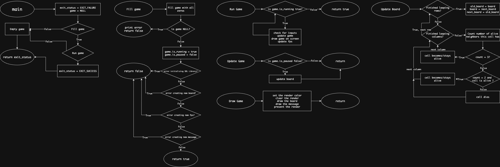

# Conway's Game of Life
<sub><sup>Note: This is for my AP Computer Science Principles Summer work made by me</sup></sub>

## 1. What is Conway's Game of Life?

Created by British mathematician John Horton Conway in the 1970's, Conway's Game of Life is a [turing complete](https://en.wikipedia.org/wiki/Turing_completeness) zero-player game, meaning beyond its initial setup, the game runs with zero input. 

Being a [cellular automaton](https://en.wikipedia.org/wiki/Cellular_automaton), the world is filled with a grid of cells that are either on or off, signifying being alive or dead. Each cell has a neighborhood of 8 neighbor cells adjacent to that cell (also known as the [Moore neighborhood](https://en.wikipedia.org/wiki/Moore_neighborhood)). There are four rules that decide the state of each cell.

Let $n$ be the number of alive neighbors a cell has,
1. If $n < 2$, the cell dies. 
2. If $n > 3$, the cell dies.
3. If $2 \leq n \leq 3$, the cell lives.
4. If $n = 3$, the  cell comes back to life.

The four rules are imitations of real life, death by underpopulation/overpopulation, a balance, and reproduction.

## 2. Installation

Download the following libraries: [sdl2](https://github.com/libsdl-org/SDL/releases), [sdl2_images](https://github.com/libsdl-org/SDL_image/releases), [sdl2_ttf](https://github.com/libsdl-org/SDL_ttf/releases), [sdl2_mixer](https://github.com/libsdl-org/SDL_mixer/releases).

### Mac/Brew
```
brew install sdl2 sdl2_image sdl2_ttf sdl2_mixer
```

and have a C compiler (gcc or clang).

If you're cool and use git:

```
git clone https://github.com/Garfungled/Conway
cd Conway
```

or just download all the files on the Github page.

## 3. How to use
### Run the program:
```
make clean run
```

### Controls
Plus Sign (+): Speeds up the program \
Minus Sign (-): Slows down the program \
Escape (ESC): Quit \
R: Refreshes the board \
C: Clear the board \
Left Mouse Click: Turns a cell on/off

## 4. Diagram 
Here is the fairly simple flowchart of this program. Only the essentials are shown or else the flow chart would get to large and needlessly complicated.



## 5. Future TODO's

- Add a way to import online Conway templates
- Add colors for how long a cell has been alive